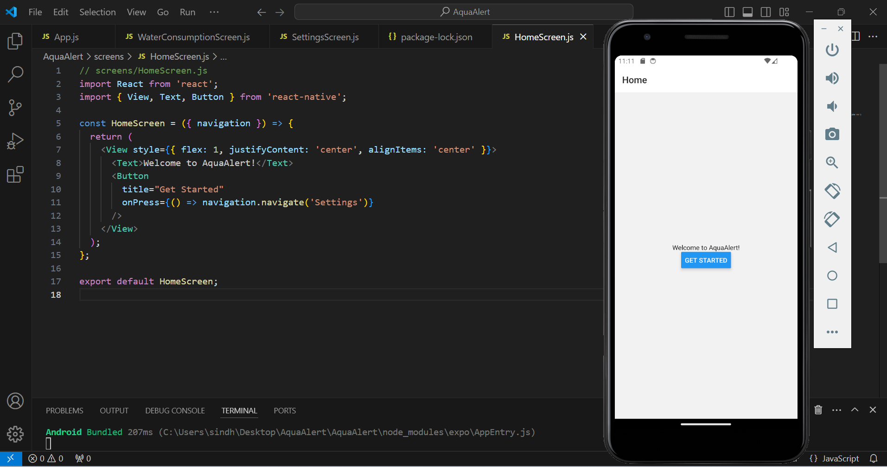
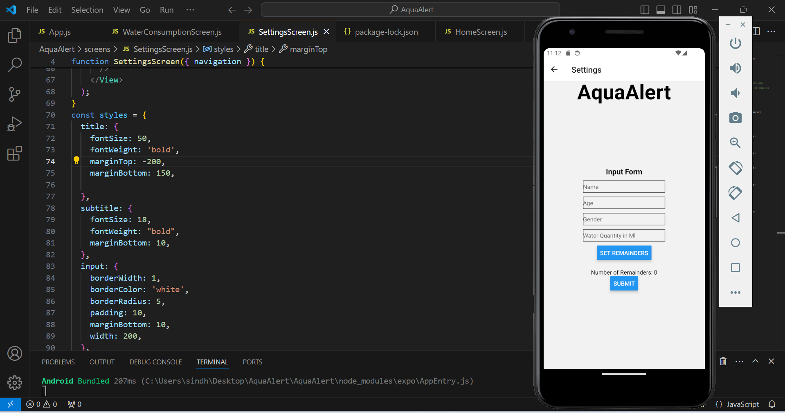
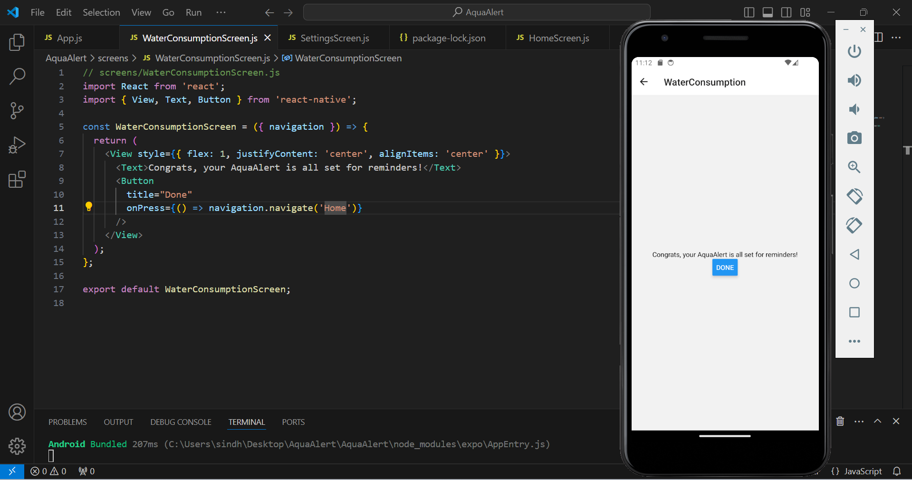

# Tech For Mobile Apps

## Student1

**Name**: Sindhujha Chava

**Email**: chavasa@mail.uc.edu

## student2

**Name**: Sai Bhavana Pagadavarapu

**Email**: pagadasn@mail.uc.edu

### Respository Link

Link for my Respository:
[https://github.com/sindhujha006/tech/edit/main/README.md](https://github.com/sindhujha006/tech/edit/main/README.md)

Certainly, here are the key points in sentences:

- **Navigation Setup**:
  - The application utilizes React Navigation for navigation, with a `NavigationContainer` wrapping the navigation structure and a stack navigator created using `createStackNavigator`.

- **Screens**:
  - **HomeScreen**:
    - It presents a welcome message and a "Get Started" button; pressing this button navigates to the Settings screen.
  - **SettingsScreen**:
    - Users can input their name, age, gender, and desired water quantity.
    - State management for these inputs is handled using `useState`.
    - It displays the number of remainders set and allows users to increment this count.
    - The "Submit" button takes users to the WaterConsumptionScreen.
  - **WaterConsumptionScreen**:
    - A congratulatory message for setting AquaAlert is displayed.
    - It provides a "Done" button to return to the Home screen.

- **State Management**:
  - State variables such as name, age, gender, water quantity, and remainders are managed using `useState`.

- **Styling**:
  - Basic styling is applied using inline styles and a separate `styles` object.
  - Layout is controlled using properties like `flex`, `justifyContent`, and `alignItems`.
  - Specific font sizes, weights, and styling for text and input fields are defined.
  - Input fields and buttons are styled with borders and padding.

- **Event Handling**:
  - Event handlers, such as `onPress`, are used to manage navigation and actions like incrementing remainders and logging data.

- **Text Input Validation**:
  - Numeric keyboard type is enforced for age and water quantity inputs.

- **Reusable Styling**:
  - Styling properties are defined in a `styles` object for better reusability across components.

- **Functional Components**:
  - All screens are implemented as functional components for simplicity and efficiency.
 
    
## Screenshots

### Demostration Video

video:

